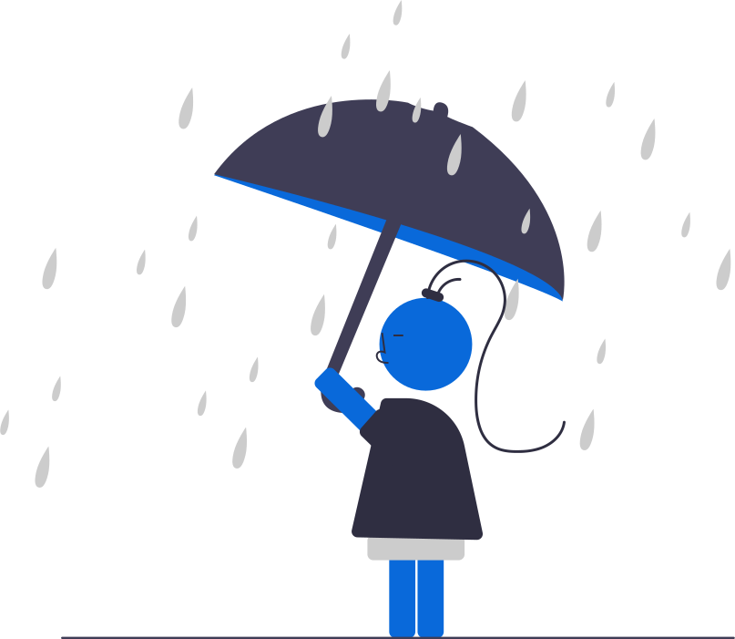

 
<h1>Rain Simulation</h1>

A simple project on simulation of rain

## About

This project is mainly based on Kinematics and Dynamics. It uses <a href="https://en.wikipedia.org/wiki/Entity_component_system">Entity Component System</a> architectural pattern.

## Demonstration

<a href="https://iamrajiv.github.ioRain-Simulation/">Run Project</a>

## License

[MIT](https://github.com/iamrajiv/Rain-Simulation/blob/master/LICENSE)
